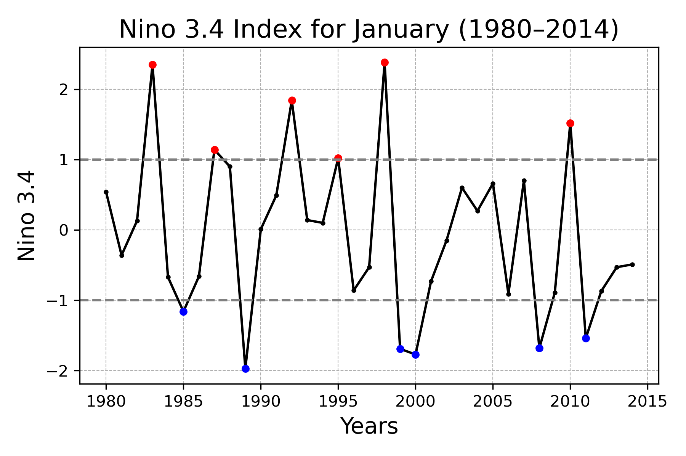
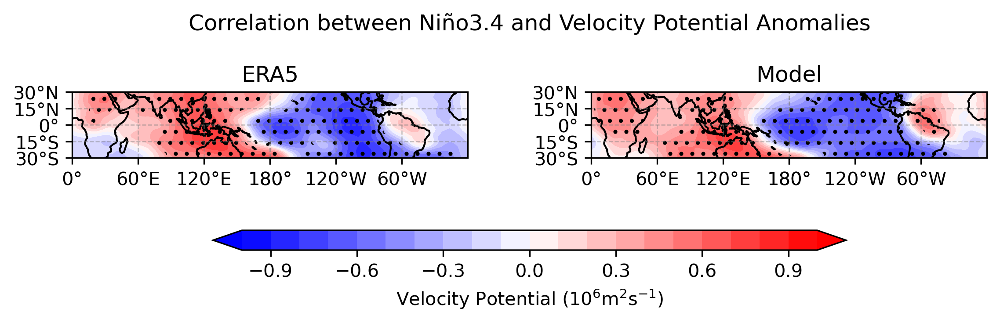
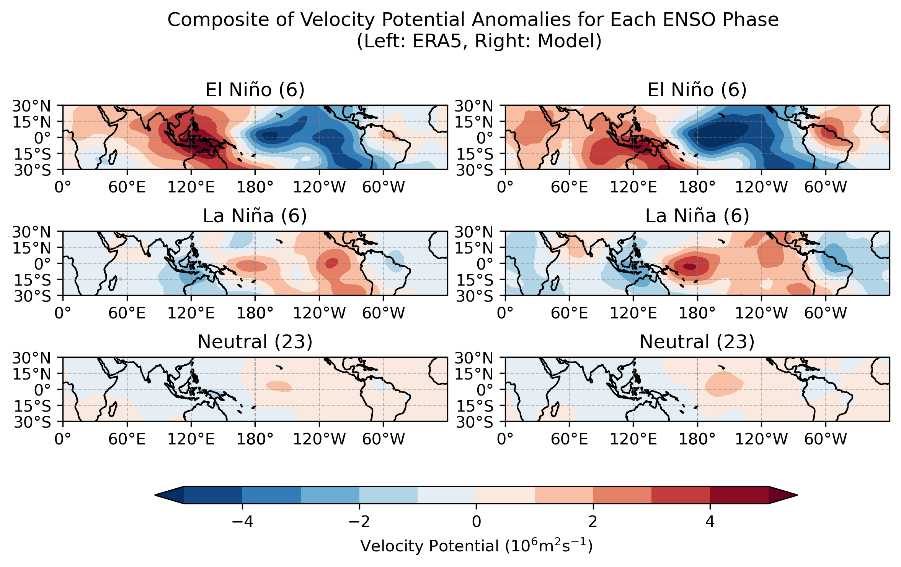
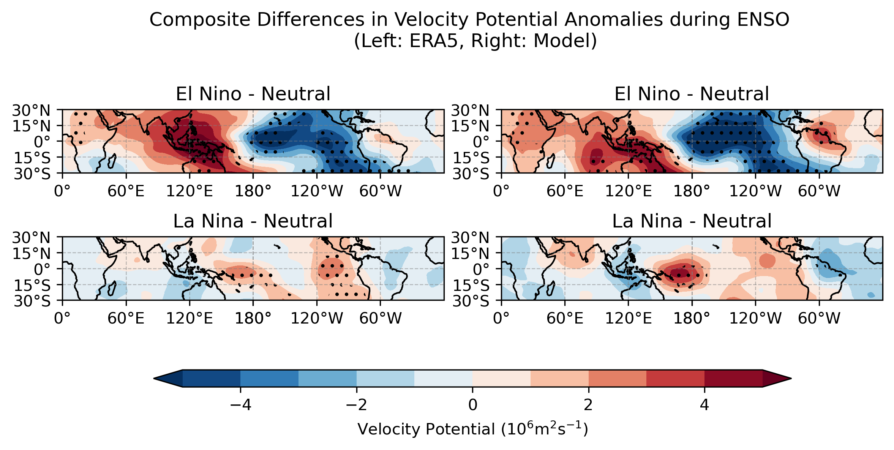

# Evaluation of Velocity Potential Simulation Performance During ENSO Periods Using Seasonal Reforecast Data
# By Jenny Jung

## Introduction
El Niño and La Niña are significant climate phenomena characterized by changes in sea surface temperatures in the equatorial Pacific. During these periods, tropical Pacific convection differs significantly compared to average conditions. Convection activity can be analyzed using variables such as precipitation, outgoing longwave radiation (OLR), and velocity potential.

In this study, I focus on the upper-level velocity potential to examine whether convection patterns during El Niño and La Niña are theoretically well represented. The velocity potential is an atmospheric variable that reflects the convergence and divergence of zonal winds, closely tied to strong convection. The velocity potential anomaly at 200 hPa is positive when cloud convection decreases and upper-level convergence dominates, while negative values indicate increased convection and upper-level divergence, making it useful for analyzing large-scale circulation patterns. It has been widely used to study climate phenomena such as the Madden-Julian Oscillation, El Niño-Southern Oscillation (ENSO), and Heavy Rainfall Extremes. Additionally, velocity potential reflects the intensity of cloud convection, which plays a critical role in the development of cumulonimbus clouds responsible for rainfall. (Hermawan et al., 2022).

## Data
### 1. Niño 3.4 index
The Nino3.4 index was obtained from the NOAA Physical Sciences Laboratory's "Climate Indices: Monthly Atmospheric and Ocean Time Series" pages. This index represents the SST anomalies in the East-Central Tropical Pacific (5°N-5°S, 170°W-120°W), calculated using NOAA ERSST V5 anomalies by CPC (Climate Prediction Center). The data can be downloaded from the following link: https://www.cpc.ncep.noaa.gov/data/indices/ersst5.nino.mth.91-20.ascii.

### 2. Model Data
The model data used in this study is the Ensemble Seasonal Reforecasts dataset, as described in Huang et al. (2017). The key characteristics of this dataset are as follows:
- Model: NCEP CFSv2 (coupled system including GFS for atmosphere, LSM for land, and MOM4 for ocean).
- Forecast: Initialized in January, April, July, and October with 91-day predictions.
For more details about the model, please refer to [Huang et al., 2017](https://doi.org/10.1175/JCLI-D-16-0642.1).

This study focuses only on the data initialized in January to minimize model errors associated with forecast lead times. The dataset spans from 1980 to 2014.

The primary variables used in this study are 200 hPa u and v wind components, from which velocity potential was calculated.

### 3. ERA5 Reanalysis
To evaluate the performance of the model, the ERA5 reanalysis dataset was used as the reference. This dataset was obtained from CPC, and the variables used were 200 hPa u and v wind components. Since the ERA5 data is provided at an hourly resolution, it was converted to daily averages to align with the model data. Using these variables, the velocity potential was calculated for comparison with the model outputs.

## Methods
### 1. Data Preprocessing
The ERA5 data, originally in hourly resolution, was converted to daily resolution.

[Jupyter notebook link](https://github.com/jyjung907/clim680_project/blob/main/convert2daily_era5.ipynb)

This code uses `xarray` to read grid data and convert hourly data to daily averages using the `groupby` function. The resulting data is then saved as a NetCDF (`.nc`) file.
(Daily averages should use all 24-hour data points, but for simplicity, the average was calculated using only the 00, 06, 12, and 18 UTC time steps.)

### 2. Calculating Velocity Potential
Velocity potential was calculated using the u and v wind components with the **`windspharm`** package.

For more details about the windspharm package, refer to the following link: https://ajdawson.github.io/windspharm/.

To run this package, the following Conda environment configuration is required: **`env_windspharm.yml`**

  - ERA5 : [Jupyter notebook link](https://github.com/jyjung907/clim680_project/blob/main/calculation_vp200_era5.ipynb)

  - Model : [Jupyter notebook link](https://github.com/jyjung907/clim680_project/blob/main/calculation_vp200_model.ipynb)

This code uses `xarray` to read grid-based u and v wind component data and calculates velocity potential using the `VectorWind` function. The calculated values are saved as a separate NetCDF file. To verify the results, a random date's data is visualized.

### 3. Analysis of Nino3.4 Index and Model Data
The Conda environment required for the analysis is **env_all.yml**
  - Calculating the Correlation Coefficient
: Assess the relationship between the Nino3.4 index and the model's velocity potential.
  - Composites of Velocity Potential Anomalies for ENSO Phases
: Generate composite maps to identify the characteristic anomaly patterns during different ENSO phases.

## Results
### 1. Time Series of the Nino3.4 Index
The figure below shows the time series of the Niño3.4 index during the analysis period from 1980 to 2014. The index clearly highlights periods of El Niño and La Niña events, which are characterized by positive and negative anomalies, respectively.

Observed ENSO Events:
  - El Niño years (red dots): 1983, 1987, 1992, 1995, 1998, 2010
  - La Niña years (blue dots): 1985, 1989, 1999, 2000, 2008, 2011

[Jupyter notebook link](https://github.com/jyjung907/clim680_project/blob/main/plt_xy_ts_nina34.ipynb)

This code uses `pandas` to read the Niño3.4 index file in ASCII format and extracts values for January from 1980 to 2014 to match the analysis period. Years with an index greater than 1 are identified as El Niño years, while those with an index less than -1 are classified as La Niña years. A time series graph is created to visualize the interannual variability of the index. Additional red and blue markers are added to the graph to indicate El Niño and La Niña years, respectively.

### 2. Correlation between Niño3.4 and Velocity Potential Anomalies
This analysis was conducted to understand the relationship between the Niño3.4 index and the velocity potential. Specifically, I computed the correlation between the interannual variability of the Niño3.4 index and the interannual variability of velocity potential from both the model and ERA5 data.

The figure below illustrates the correlation results. Significant positive correlations were observed near the Maritime Continent, while significant negative correlations appeared over the central and eastern tropical Pacific.

During El Niño events (when the Niño3.4 index is strongly positive):
  - The upper-level velocity potential over the western Pacific and the Maritime Continent tends to have positive values, indicating upper-level convergence, descending air, and drier conditions near the surface.
  - Over the central and eastern Pacific, the upper-level velocity potential exhibits negative values, indicating upper-level divergence, ascending air, and enhanced precipitation.

Model Performance: These patterns were well captured by the model, demonstrating its ability to simulate the spatial characteristics of velocity potential anomalies associated with ENSO phases.

[Jupyter notebook link](https://github.com/jyjung907/clim680_project/blob/main/plt_map_corr_bw_model.ipynb)

This code uses `pandas` to read the Niño3.4 index file. Additionally, for the model's grid data, I defined a new function (`get_anomaly`) to calculate anomalies. The function is applied separately to model and ERA5 data. Since the resolutions of the model and ERA5 differ, an interpolation function (`intp`) is defined to facilitate comparison. The daily data is averaged to monthly data, and the correlation coefficient with the Niño3.4 index is calculated using the `scipy.stats.pearsonr` function. Only regions with a 95% confidence level are highlighted in the results. Additionally, a new function (`set_latlon`) is defined to customize latitude and longitude ticks for plotting.

### 3. Composite Analysis of Velocity Potential Anomalies for ENSO Phases
The velocity potential anomalies were composited for each ENSO phase: El Niño, La Niña, and Neutral. As expected based on theoretical understanding:
  - During El Niño phases, descending air dominates over the Maritime Continent, indicated by upper-level convergence (positive velocity potential anomalies). In contrast, ascending air dominates over the central Pacific, represented by upper-level divergence (negative velocity potential anomalies).
  - During La Niña phases, the convection system shifts westward, resulting in ascending motion (upper-level divergence) over the Maritime Continent and descending motion (upper-level convergence) along the central Pacific coastline.
  - In Neutral conditions, these patterns are less pronounced and show no significant trends.

**Comparison between ERA5 and Model**
  - El Niño: The model shows stronger upper-level divergence over the central Pacific compared to ERA5.
  - La Niña: The model exhibits more pronounced upper-level convergence (positive anomalies) around the central Pacific near 180° longitude, indicating stronger descending motion during La Niña phases.

To better understand the unique atmospheric characteristics of ENSO phases, the composite differences are calculated by subtracting the Neutral state from the El Niño and La Niña phases.This approach highlights the anomalies directly associated with ENSO events, isolating the influence of El Niño and La Niña from the average climatological state. By focusing on these differences, the figure below illustrates the composite differences in velocity potential anomalies during El Niño and La Niña phases compared to Neutral conditions.

  - El Niño Phase : Significant negative anomalies over the Pacific Ocean are clearly observed. In the model data, these anomalies cover a broader latitudinal range and exhibit greater intensity compared to ERA5. Positive anomalies appear around the Maritime Continent, indicating upper-level convergence. However, in the model, these positive anomalies are relatively weaker and shifted slightly southward from the equator compared to ERA5.
  - La Niña Phase : In ERA5, significant positive anomalies (upper-level convergence) are observed near 180° longitude and the eastern Pacific, reflecting strong descending motion in these regions. The model shows larger and stronger positive anomalies near 180° longitude compared to ERA5. While positive anomalies are present over the eastern Pacific, they are not statistically significant at the 95% confidence level in the t-test.

[Jupyter notebook link](https://github.com/jyjung907/clim680_project/blob/main/plt_map_comp_anom_model.ipynb)

This code uses `pandas` to read the Niño3.4 index file and identifies years classified as El Niño, La Niña, or Neutral phases. It applies the previously defined function (`get_anomaly`) to read model and ERA5 data, calculates monthly anomalies, and computes composites for each ENSO phase. Composite differences are calculated by subtracting Neutral phase composites from El Niño and La Niña composites. Only regions with a 95% confidence level are highlighted. The pre-defined function (`set_latlon`) for customizing latitude and longitude ticks is also utilized for plotting.

## Summary
This study assessed the performance of a seasonal reforecast model in simulating velocity potential anomalies during ENSO phases, with the Niño3.4 index serving as an indicator of El Niño and La Niña events. Velocity potential, a key atmospheric variable, was used to analyze upper-level convergence and divergence patterns, providing insights into ENSO-related convection dynamics. The time series analysis of the Niño3.4 index from 1980 to 2014 identified significant El Niño and La Niña events, forming the basis for subsequent analyses. Correlation results showed positive anomalies over the Maritime Continent and negative anomalies over the central and eastern Pacific, consistent with theoretical expectations. The model successfully reproduced these patterns, though with discrepancies in intensity and spatial distribution compared to ERA5.

Composite analyses revealed that during El Niño, descending motion (positive anomalies) dominated over the Maritime Continent, while ascending motion (negative anomalies) prevailed over the central Pacific. La Niña showed a westward-shifted convection system with opposite patterns. Subtracting Neutral composites further highlighted ENSO-driven anomalies, showing upper-level divergence over the Pacific during El Niño and strong convergence during La Niña. While the model captured these features well, it overestimated anomaly intensities in certain regions. These findings demonstrate the model’s capability to replicate ENSO dynamics while identifying areas for improvement, emphasizing the utility of velocity potential as a diagnostic tool for model evaluation.

## References
NOAA Physical Sciences Laboratory. "Climate Indices: Monthly Atmospheric and Ocean Time Series." Niño3.4 index derived from NOAA ERSST V5 anomalies. Available at: https://www.cpc.ncep.noaa.gov/data/indices/ersst5.nino.mth.91-20.ascii. 

Hermawan, E., Maulana, T., Gernowo, R., Andarini, D.F. (2022). Effects of El-Nino and La-Nina on the Velocity Potential at 200 hPa over Maritime Continent. In: Yulihastin, E., Abadi, P., Sitompul, P., Harjupa, W. (eds) Proceedings of the International Conference on Radioscience, Equatorial Atmospheric Science and Environment and Humanosphere Science, 2021. Springer Proceedings in Physics, vol 275. Springer, Singapore. https://doi-org.mutex.gmu.edu/10.1007/978-981-19-0308-3_76

Huang, B., C. Shin, J. Shukla, L. Marx, M. A. Balmaseda, S. Halder, P. Dirmeyer, and J. L. Kinter, 2017: Reforecasting the ENSO Events in the Past 57 Years (1958–2014). J. Climate, 30, 7669–7693, https://doi.org/10.1175/JCLI-D-16-0642.1.

